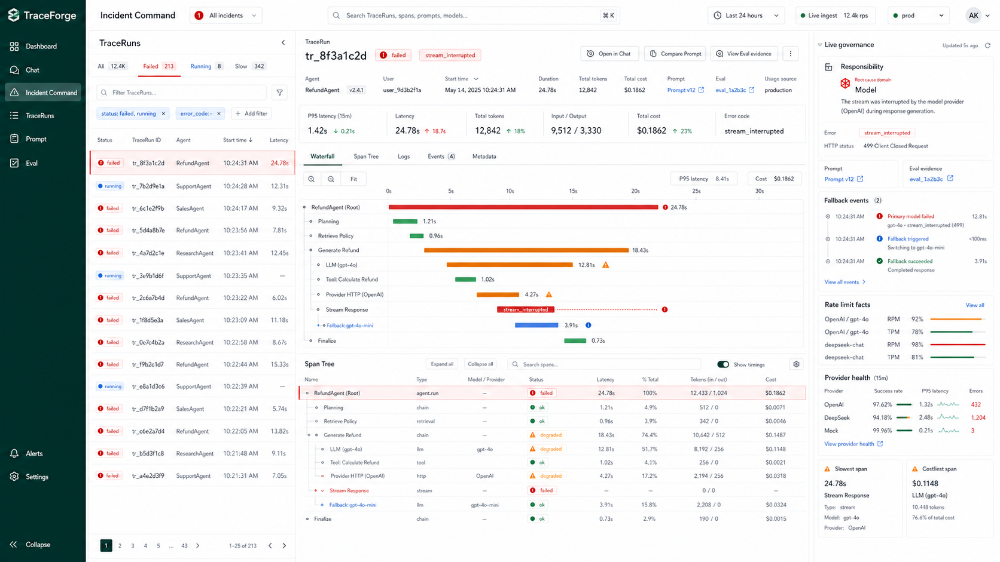
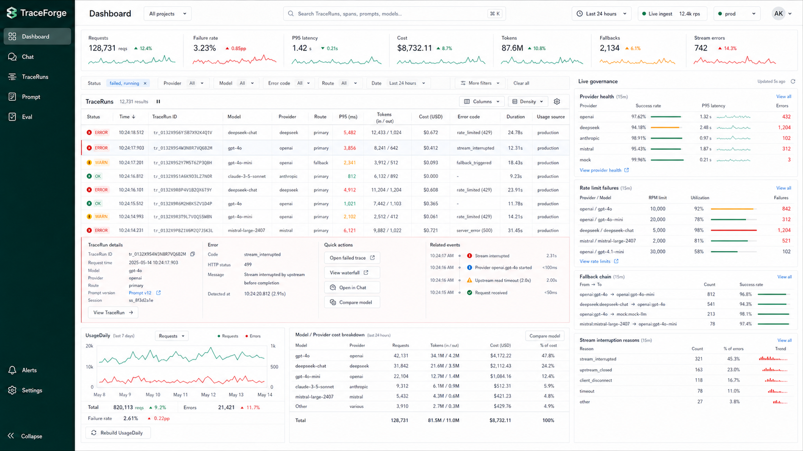
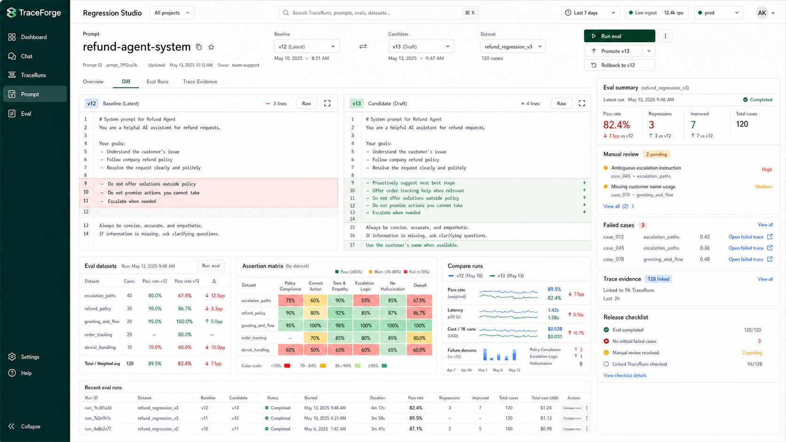

# TraceForge UI Prototypes

This folder stores the high-fidelity UI prototype images for the TraceForge console redesign.

## Canonical Round 2 Prototypes

Use these three images as the current implementation target:

1. `traceforge-ui-r2-01-incident-command.png`
   - Primary console direction.
   - V1-style Incident Command shell.
   - TraceRun list, selected TraceRun detail, waterfall, span tree, and live governance rail.

2. `traceforge-ui-r2-02-live-governance-dashboard.png`
   - Dashboard direction.
   - Dense V2-style operational tables and governance panels inside the V1 shell.
   - Usage, provider/model health, fallback, rate-limit, stream interruption, and cost overview.

3. `traceforge-ui-r2-03-regression-studio.png`
   - Prompt/Eval module direction.
   - V3-style Regression Studio workspace inside the same global shell.
   - Prompt diff, Eval summary, assertion matrix, comparison charts, and Trace evidence.

The first-round images are kept as historical exploration only:

- `traceforge-ui-v1-incident-command.png`
- `traceforge-ui-v2-ops-workbench.png`
- `traceforge-ui-v3-regression-studio.png`

## Implementation Notes

- Treat the images as layout, hierarchy, density, and visual-system references, not exact text fixtures.
- Remove unsupported navigation such as `Alerts` until a matching model and workflow exist.
- Missing product data should be supplied through local mock view-model adapters, not by changing the production schema prematurely.
- The implementation plan is in `UI_REDESIGN_PLAN.md`.
